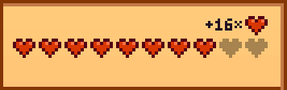

# Hearts Overflow

Hearts Overflow is a Stardew Valley mod that stores and displays hearts earned above the maximum.

When you earn friendship points with an NPC above the current maximum, Hearts Overflow will store
those points and display them as a counter of additional hearts above the normal friendship bar.
These additional friendship points are not lost if you lose friendship with the NPC or if your
maximum friendship with the NPC increases.

There is no limit to how many friendship points can be stored, although the number of hearts
displayed is limited by available screen space in the menu.

This mod should be fully compatible with any mod that doesn't extensively modify or replace the
friendship system or the social tab UI. Custom NPCs and events are compatible.

## Installation

This mod requires [SMAPI](https://github.com/Pathoschild/SMAPI).

You can download Hearts Overflow from the [releases
page](https://github.com/Esper89/StardewValley-HeartsOverflow/releases/latest), below the
changelog.

To install Hearts Overflow, just extract the zip file and place the `Hearts Overflow` folder into
your `Mods` folder.

## Building

To build Hearts Overflow, run `dotnet build` in the project's root directory. The output will be
automatically installed into your Stardew Valley mods directory.

To build Hearts Overflow in release mode, run `dotnet build --configuration Release`. This will also
create a `.zip` file for easy distribution.

## License

Copyright © 2025 Esper Thomson

This program is free software: you can redistribute it and/or modify it under the terms of version
3 of the GNU Affero General Public License as published by the Free Software Foundation.

This program is distributed in the hope that it will be useful, but WITHOUT ANY WARRANTY; without
even the implied warranty of MERCHANTABILITY or FITNESS FOR A PARTICULAR PURPOSE. See the GNU Affero
General Public License for more details.

You should have received a copy of the GNU Affero General Public License along with this program.
If not, see <https://www.gnu.org/licenses>.

Additional permission under GNU AGPL version 3 section 7

If you modify this Program, or any covered work, by linking or combining it with Stardew Valley (or
a modified version of that program), containing parts covered by the terms of its license, the
licensors of this Program grant you additional permission to convey the resulting work.
