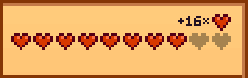

# Hearts Overflow

Hearts Overflow is a Stardew Valley mod that lets you earn friendship hearts with NPCs and animals
above the maximum.

When you earn friendship points with an NPC or animal above the current maximum friendship, Hearts
Overflow will store those points and display them as a counter of additional hearts. When you lose
friendship or your maximum friendship increases, your overflow friendship will be reduced to make up
the difference. If you have the exact same amount of friendship with multiple characters, their
order on the social tab or animal tab will be sorted by how much overflow friendship you have with
each of them.

There is no limit to how many overflow hearts can be stored, although the number of hearts displayed
is limited by available screen space in the menu.



For screenshots of this mod's features, see [`media/screenshots`](media/screenshots).

This mod is compatible with multiplayer and should be compatible with any mod that doesn't
significantly modify or replace the friendship system or the social or animal UIs. This means that
custom NPCs, animals, and events are compatible. See [Compatibility](#compatibility) for more
information.

Hearts Overflow provides extensibility features other mods can use. See
[Extensibility](#extensibility) for documentation.

## Installation

This mod requires [SMAPI]. You may also want to install [Generic Mod Config Menu][GMCM] and
[GMCM Options] to configure this mod.

You can download Hearts Overflow from the [releases page][releases], below the changelog. To install
Hearts Overflow, just extract the zip file and place the `Hearts Overflow` folder into your `Mods`
folder.

## Configuration

Hearts Overflow can be configured in-game with [Generic Mod Config Menu][GMCM] and [GMCM Options].
Alternatively, running Stardew Valley with Hearts Overflow installed will generate
`Hearts Overflow/config.json`. You can edit this file to configure the mod; make sure to restart the
game to apply changes to this file.

## Compatibility

Hearts Overflow is compatible with multiplayer and with mods that add custom NPCs, custom animals,
and custom events. Mods that significantly alter the friendship system or the social or animal UIs
may not be compatible.

Some mods that may not be clearly compatible are…

### Compatible

- [Better Game Menu] is compatible.
- [Free Love] is compatible.

### Incompatible

- Overflow hearts do not appear on the animal menu when [Animal Husbandry] is installed.
- The mod Negative Hearts on Nexus Mods is known to be incompatible.

## Extensibility

Hearts Overflow provides several extensibility features other mods can use it interact with it,
extend it, or improve compatibility.

Other mods can increase and decrease a player's overflow friendship with an NPC or animal the same
way they would increase or decrease the regular non-overflow friendship; no special interaction is
needed.

Hearts Overflow does not actually raise the maximum amount of friendship players can have. Overflow
friendship is stored separately from regular friendship for compatibility. This mod's extensibility
features provide other mods the ability to read overflow friendship. Keep in mind that players can
have overflow friendship with NPCs regardless of their current maximum friendship. **For example, a
player that's at eight hearts and has six overflow hearts with a datable NPC could have fourteen
total hearts with them without dating them.**

If your mod interacts with or relies on Hearts Overflow at all, make sure to add
`Esper89.HeartsOverflow` to your mod's dependencies in your `manifest.json`, like so:

```json
"Dependencies": [
    { "UniqueID": "Esper89.HeartsOverflow", "IsRequired": false }
]
```

Or like so:

```json
"Dependencies": [
    { "UniqueID": "Esper89.HeartsOverflow", "IsRequired": true }
]
```

Note that Hearts Overflow is licensed under the GNU AGPL, which says that derivative works must also
be licensed under the GNU AGPL and has an expansive definition of derivative works. While the C# API
code is under the unlicense, and the other provided extensibility features don't require any
components of this mod to use, some mods that interact with Hearts Overflow might still be
considered derivative works. **If your mod extends, significantly relies on, links to, or contains
components of Hearts Overflow, it may be considered a derivative work and need to be licensed under
the GNU AGPL.** See [License](#license) or [`LICENSE`](LICENSE) for more information; this paragraph
is not part of this mod's license, nor is it legal advice.

### Content Patcher

Content packs for [Content Patcher] can use the [tokens] provided by this mod, `TotalHearts` and
`OverflowHearts`, to get the number of total hearts or overflow hearts the current player has with
NPCs. They behave the same as Content Patcher's built-in [`Hearts` token][Relationship tokens]. For
example, you could use them as follows:

```json
{
    "Action": "EditData",
    "Target": "...",
    "Fields": {
        "{{ModId}}_Foo": {
            "Text": "Is {{Esper89.HeartsOverflow/TotalHearts:Abigail}} too many hearts with Abby?"
        }
    },
    "When": {
        "Esper89.HeartsOverflow/TotalHearts:Alex": "{{Range: 15, 25}}",
        "Query: {{Esper89.HeartsOverflow/OverflowHearts:Caroline}} > 100": true,
        "Esper89.HeartsOverflow/TotalHearts": "Clint:35, Demetrius:35"
    }
}
```

The value of these tokens may be as high as `int.MaxValue` (2 147 483 647) or as low as
`int.MinValue` (−2 147 483 648) and is handled as an `int`. If the number of total hearts or
overflow hearts is outside these bounds, the value returned from the Content Patcher token will be
clamped to within these bounds. **You should avoid performing arithmetic on these tokens unless you
are sure it won't cause any integer overflow errors.** If this is limiting to you, consider using
the C# API instead. As thematic as integer overflow errors would be, I'm sure your users wouldn't
appreciate them!

### Game Data

Hearts Overflow provides [game state queries][GSQs] for checking overflow friendship:
`PlayerTotalHearts`, `PlayerOverflowHearts`, `PlayerTotalFriendshipPoints`, and
`PlayerOverflowFriendshipPoints`. These queries can check if a specified player's total friendship
or overflow friendship is within a specified range. They behave the same as Stardew Valley's
built-in [`PLAYER_FRIENDSHIP_POINTS` and `PLAYER_HEARTS` game state queries][Relationship GSQs]. For
example, you could use them as follows:

```json
{
    "{{ModId}}_Bar": {
        "Condition": "Esper89.HeartsOverflow_PlayerTotalFriendshipPoints Current Dwarf 5000"
    },
    "{{ModId}}_Baz": {
        "Condition": "Esper89.HeartsOverflow_PlayerOverflowHearts All AnyDateable 100 150"
    }
}
```

Be warned that the value used by the `PlayerOverflowFriendshipPoints` game state query does not map
cleanly to hearts! The maximum amount of regular non-overflow friendship points a player can have
with an NPC is not a multiple of the number of friendship points in one heart, and overflow
friendship is just the number of friendship points above the maximum. **Prefer the other game state
queries in most contexts, especially ones that care about heart levels.**

This mod also provides [event preconditions], `TotalFriendship` and `OverflowHearts`, to require a
minimum amount of total friendship points or overflow hearts with NPCs before an event can happen.
They behave the same as Stardew Valley's built-in
[`Friendship` event precondition][Player event preconditions], except that the `OverflowHearts`
event precondition operates on hearts instead of friendship points. For example, you could use them
as follows:

```json
{
    "{{ModId}}_Qux/Friendship Elliott 2500 Emily 2500/Esper89.HeartsOverflow_OverflowHearts Elliott 10 Emily 10": "...",
    "{{ModId}}_Cor/Esper89.HeartsOverflow_TotalFriendship Evelyn 50000 Haley 2000": "..."
}
```

The game state queries and event preconditions provided by this mod have no size limits for any of
the numbers involved, and there is no risk of integer overflow errors.

If you need to clear the current player's overflow friendship with an NPC, Hearts Overflow provides
a [trigger action], `ClearOverflowFriendship`. It behaves similarly to Stardew Valley's
built-in [`AddFriendshipPoints` trigger action][Built-in trigger actions], but it doesn't have the
second parameter `<count>`, and it works even if the NPC is not currently valid for overflow
friendship. As an example, you could use the trigger action like so:

```json
{
    "{{ModId}}_Xyz": {
        "Id": "{{ModId}}_Xyz",
        "Trigger": "LocationChanged",
        "Actions": [
            "Esper89.HeartsOverflow_ClearOverflowFriendship Harvey"
        ]
    }
}
```

**If you need to use this trigger action, please be careful with it, as it could reset a lot of
progress!**

### C#

This mod [provides an API][Mod APIs] that other C# mods can use to interoperate with it. To use it,
copy [`Api.cs`](Api.cs) into your mod and remove any methods you won't be using, for compatibility.
To get an instance of the API object, call:

```cs
helper.ModRegistry.GetApi<HeartsOverflow.IHeartsOverflowApi>("Esper89.HeartsOverflow")
```

Make sure to check that the object isn't `null` before using it.

Review the XML documentation in `Api.cs` for more information on how to use the API and what
features it has.

## Contributing

Issues and pull requests are welcome!

### Building

To build Hearts Overflow, run `dotnet build` in the project's root directory. The output will be
automatically installed into your Stardew Valley mods directory.

To build Hearts Overflow in release mode, run `dotnet build --configuration Release`. This will also
create a `.zip` file for easy distribution.

## License

Copyright © 2025–2026 Esper Thomson

This program is free software: you can redistribute it and/or modify it under the terms of version
3 of the GNU Affero General Public License as published by the Free Software Foundation.

This program is distributed in the hope that it will be useful, but WITHOUT ANY WARRANTY; without
even the implied warranty of MERCHANTABILITY or FITNESS FOR A PARTICULAR PURPOSE. See the GNU Affero
General Public License for more details.

You should have received a copy of the GNU Affero General Public License along with this program.
If not, see <https://www.gnu.org/licenses>.

Additional permission under GNU AGPL version 3 section 7

If you modify this Program, or any covered work, by linking or combining it with Stardew Valley (or
a modified version of that program), containing parts covered by the terms of its license, the
licensors of this Program grant you additional permission to convey the resulting work.

### APIs

This mod uses API code from other mods to interoperate with them. See [`api`](api) for attribution.

This mod provides API code other mods may use to interoperate with it. See [`Api.cs`](Api.cs) for
licensing.

[releases]: https://github.com/Esper89/StardewValley-HeartsOverflow/releases
[SMAPI]: https://github.com/Pathoschild/SMAPI
[GMCM]: https://github.com/spacechase0/StardewValleyMods/tree/develop/framework/GenericModConfigMenu
[GMCM Options]: https://github.com/jltaylor-us/StardewGMCMOptions
[Better Game Menu]: https://github.com/KhloeLeclair/StardewMods/tree/main/BetterGameMenu
[Free Love]: https://github.com/aedenthorn/StardewValleyMods/tree/master/FreeLove
[Animal Husbandry]: https://github.com/Digus/StardewValleyMods/tree/master/ButcherMod
[Content Patcher]: https://github.com/Pathoschild/StardewMods/tree/stable/ContentPatcher
[tokens]: https://github.com/Pathoschild/StardewMods/blob/stable/ContentPatcher/docs/author-guide/tokens.md
[Relationship tokens]: https://github.com/Pathoschild/StardewMods/blob/stable/ContentPatcher/docs/author-guide/tokens.md#relationships
[GSQs]: https://stardewvalleywiki.com/Modding:Game_state_queries
[Relationship GSQs]: https://stardewvalleywiki.com/Modding:Game_state_queries#Player_relationships
[event preconditions]: https://stardewvalleywiki.com/Modding:Event_data#Event_preconditions
[Player event preconditions]: https://stardewvalleywiki.com/Modding:Event_data#Current_player
[trigger action]: https://stardewvalleywiki.com/Modding:Trigger_actions
[Built-in trigger actions]: https://stardewvalleywiki.com/Modding:Trigger_actions#Built-in_actions
[Mod APIs]: https://stardewvalleywiki.com/Modding:Modder_Guide/APIs/Integrations#Mod-provided_APIs
